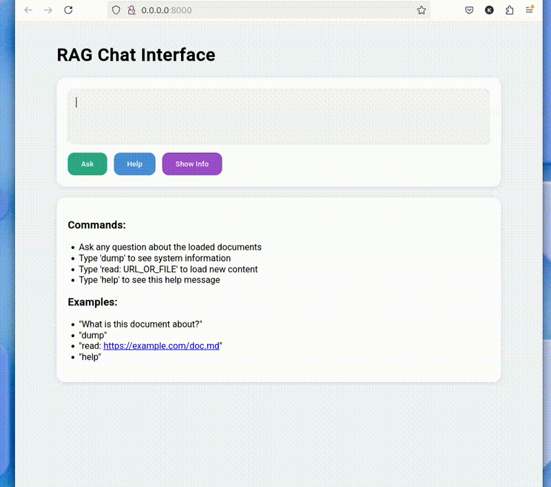

# RAG chat interface

A self-hosted, privacy-focused RAG (Retrieval-Augmented Generation) interface for intelligent document interaction. Turn any document into a knowledge base you can chat with.

A powerful and secure document interaction system that transforms any document into an interactive knowledge base. Using advanced AI models that run entirely on-premises, DocuChat allows you to have natural conversations with your documents while maintaining complete data privacy and security.

## Security & Privacy

- **Complete Data Isolation**: All documents and conversations stay within your network
- **On-Premises Processing**: AI models run locally, ensuring no data leaves your secure environment
- **Local Vector Storage**: Document embeddings are stored in your local Milvus instance
- **Network Control**: No external API dependencies for core functionality

## Local AI models

The system uses the following model configurations by default:
- **LLM Model**: `ibm-granite/granite-3.2-2b-instruct`
- **Embedding Model**: `ibm-granite/granite-embedding-30m-english`

You can configure different models based on your needs:
- Smaller models for faster responses and lower resource usage
- Larger models for higher quality responses when compute resources are available
- Balance between model size and performance based on your hardware capabilities

## Demo



## Features

- Fully on-premises deployment for maximum security and privacy
- All documents and embeddings stored locally in your secure environment
- No external API calls - all processing happens within your network
- Self-contained AI models running locally
- Interactive web interface for document Q&A
- Support for loading content from:
  - Local files
  - Local directories (recursive scanning)
  - URLs
- Support for multiple document formats:
  - PDF documents
  - HTML pages
  - Markdown files
  - Plain text files
- Flexible model selection to balance performance and resource usage
- Configurable AI models to match your hardware capabilities

## Prerequisites

- Python 3.8+
- GPU (recommended) or CPU for model inference

## Installation

1. Clone the repository:
```bash
git clone https://github.com/yaacov/rag-chat-interface.git
cd rag-chat-interface
```

2. Install dependencies:
```bash
# Optional: set a virtual env
python3.10 -m venv .venv
source .venv/bin/activate

# Install dependencies
pip install -r requirements.txt
```

## Usage

1. Start the server:
```bash
.venv/bin/python main.py \
    [--source INITIAL_SOURCE] \
    [--host HOST] \
    [--port PORT] \
    [--db-path DB_PATH] \
    [--models-cache-dir CACHE_DIR] \
    [--downloads-dir DOWNLOADS_DIR] \
    [--chunk_size CHUNK_SIZE] \
    [--chunk_overlap CHUNK_OVERLAP] \
    [--device GPU_DEVICE] \
    [--llm-model LLM_MODEL_NAME] \
    [--query-log-db QUERY_LOG_DB] \
    [--log-queries]
```

Example:
```bash
# Override LLM model and GPU device
.venv/bin/python main.py --llm-model ibm-granite/granite-3.2-8b-instruct --device cpu
```

Arguments:
- `--source`: Initial source to load - can be a file, directory, or URL (optional)
- `--host`: Host to bind the server to (default: 0.0.0.0)
- `--port`: Port to bind the server to (default: 8000)
- `--db-path`: Path to the Milvus database file (default: ./rag_milvus.db)
- `--models-cache-dir`: Directory to store downloaded models (default: ./models_cache)
- `--downloads-dir`: Directory to store downloaded files (default: ./downloads)
- `--chunk_size`: Maximum size of each document chunk (default: 1000 characters)
- `--chunk_overlap`: Overlap between chunks (default: 200 characters)
- `--device`: Force a specific device (e.g., 'cuda', 'cpu', 'mps'). If not provided, best available device is automatically selected
- `--llm-model`: Override the default LLM model (default: ibm-granite/granite-3.2-2b-instruct)
- `--query-log-db`: Path to SQLite database for query logging (default: ./query_logs.db)
- `--log-queries`: Enable logging of queries and responses to SQLite database

2. Open your browser and navigate to `http://localhost:8000`

## License

MIT License

## Contributing

Contributions are welcome! Please feel free to submit a Pull Request.
