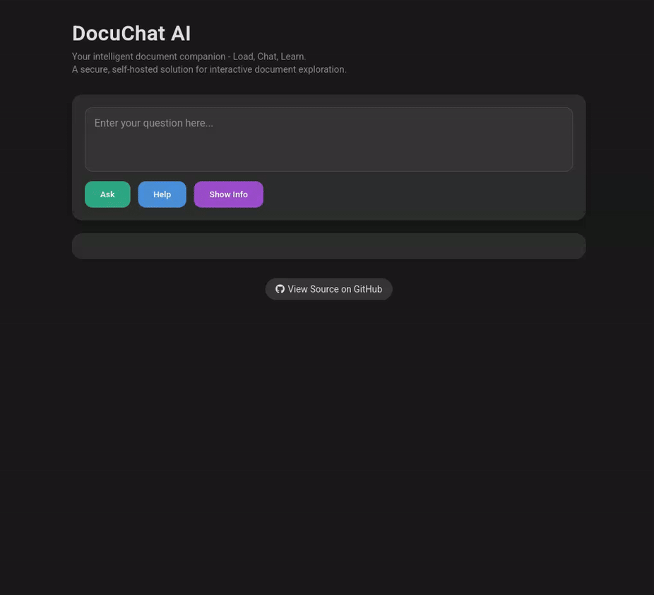

# RAG chat interface

A self-hosted, privacy-focused RAG (Retrieval-Augmented Generation) interface for intelligent document interaction. Turn any document into a knowledge base you can chat with.

A powerful and secure document interaction system that transforms any document into an interactive knowledge base. Using advanced AI models that run entirely on-premises, DocuChat allows you to have natural conversations with your documents while maintaining complete data privacy and security.

## Security & Privacy

- **Complete Data Isolation**: All documents and conversations stay within your network
- **On-Premises Processing**: AI models run locally, ensuring no data leaves your secure environment
- **Local Vector Storage**: Document embeddings are stored in your local Milvus instance
- **Network Control**: No external API dependencies for core functionality

## Local AI models

The system uses the following model configurations by default:

- **LLM Model**: `ibm-granite/granite-3.3-2b-instruct`
- **Embedding Model**: `ibm-granite/granite-embedding-30m-english`
- **MAAS**: Optionaly, can use Model-as-a-Service (MAAS) servers (default OFF).

You can configure different models based on your needs:

- Smaller models for faster responses and lower resource usage
- Larger models for higher quality responses when compute resources are available
- Balance between model size and performance based on your hardware capabilities

## Demo



## Features

- Fully on-premises deployment for maximum security and privacy
- All documents and embeddings stored locally in your secure environment
- No external API calls - all processing happens within your network
- Self-contained AI models running locally
- Interactive web interface for document Q&A
- Support for loading content from:
  - Local files
  - Local directories (recursive scanning)
  - URLs
- Support for multiple document formats:
  - PDF documents
  - HTML pages
  - Markdown files
  - Plain text files
- Flexible model selection to balance performance and resource usage
- Configurable AI models to match your hardware capabilities
- Optional, MAAS integration:
  - Connect to external LLM and embedding API services
  - Use more powerful models without local hardware constraints
  - Mix local and remote models according to your needs
  - Maintain document privacy while leveraging external compute resources

## Prerequisites

- Python 3.8+
- GPU (recommended) or CPU for model inference

## Installation

1. Clone the repository:

    ```bash
    git clone https://github.com/yaacov/rag-chat-interface.git
    cd rag-chat-interface
    ```

2. Install dependencies:

```bash
# Optional: set a virtual env
python3.13 -m venv .venv
source .venv/bin/activate

# Install dependencies
pip install -r requirements.txt
```

## Usage

1. Start the server:

```bash
.venv/bin/python main.py \
    [--source INITIAL_SOURCE] \
    [--host HOST] \
    [--port PORT] \
    [--db-path DB_PATH] \
    [--models-cache-dir CACHE_DIR] \
    [--downloads-dir DOWNLOADS_DIR] \
    [--chunk_size CHUNK_SIZE] \
    [--chunk_overlap CHUNK_OVERLAP] \
    [--device GPU_DEVICE] \
    [--llm-model LLM_MODEL_NAME] \
    [--llm-api-url LLM_API_URL] \
    [--llm-api-key LLM_API_KEY] \
    [--embedding-api-url EMBEDDING_API_URL] \
    [--embedding-api-key EMBEDDING_API_KEY] \
    [--query-log-db QUERY_LOG_DB] \
    [--log-queries]
```

Example:

```bash
# Override LLM model and GPU device
.venv/bin/python main.py --llm-model ibm-granite/granite-3.2-8b-instruct --device cpu
```

Arguments:

- `--source`: Initial source to load - can be a file, directory, or URL (optional)
- `--host`: Host to bind the server to (default: 0.0.0.0)
- `--port`: Port to bind the server to (default: 8000)
- `--db-path`: Path to the Milvus database file (default: ./rag_milvus.db)
- `--models-cache-dir`: Directory to store downloaded models (default: ./models_cache)
- `--downloads-dir`: Directory to store downloaded files (default: ./downloads)
- `--chunk_size`: Maximum size of each document chunk (default: 1000 characters)
- `--chunk_overlap`: Overlap between chunks (default: 200 characters)
- `--device`: Force a specific device (e.g., 'cuda', 'cpu', 'mps'). If not provided, best available device is automatically selected
- `--llm-model`: Override the default LLM model (default: ibm-granite/granite-3.2-2b-instruct)
- `--embedding-model`: Override the default embedding model (default: ibm-granite/granite-embedding-30m-english)
- `--llm-api-url`: URL for the LLM API service (enables MAAS mode for LLM)
- `--llm-api-key`: API key for the LLM API service
- `--embedding-api-url`: URL for the embedding API service (enables MAAS mode for embeddings)
- `--embedding-api-key`: API key for the embedding API service
- `--query-log-db`: Path to SQLite database for query logging (default: ./query_logs.db)
- `--log-queries`: Enable logging of queries and responses to SQLite database

2. Open your browser and navigate to `http://localhost:8000`

## Using with Model-as-a-Service (MAAS)

While RAG chat interface is designed to run models locally, you can also connect it to external Model-as-a-Service (MAAS) providers. This allows you to:

- Use more powerful models that may not fit on your local hardware
- Leverage specialized models offered by MAAS providers
- Distribute computational load to external services while keeping document data local

### MAAS Configuration

To use MAAS for language model (LLM) capabilities:

```bash
.venv/bin/python main.py \
    --llm-api-url "https://your-llm-service.com/api" \
    --llm-api-key "your-api-key" \
    --llm-model "granite-3-8b-instruct" \
    --embedding-api-url "https://your-embedding-service.com/api" \
    --embedding-api-key "your-api-key" \
    --embedding-model "ibm-granite/granite-embedding-30m-english" \
    --chunk_size 1000
```

You can mix local and remote models. For example, use a local embedding model with a remote LLM:

```bash
.venv/bin/python main.py \
     --llm-api-url "https://your-llm-service.com/api" \
     --llm-api-key "your-api-key" \
     --llm-model "granite-3-8b-instruct"
```

### MAAS API Requirements

The MAAS APIs must be compatible with the following endpoints:

- LLM API: `/v1/completions` and `/v1/chat/completions`
- Embedding API: `/v1/embeddings`

These endpoints should follow standard API formats similar to those used by MAAS providers.

## Kubernetes Deployment

Apply the manifest and expose the service as a public Route:

```bash
oc apply -f deployment.yaml
oc get routes
```

Visit the listed `HOST/PORT` to access the UI.

### Creating the Secret and Applying

1. Copy `.env.example` to `.env` and customize as needed:

   ```bash
   cp .env.example .env
   # edit .env to fill in your API URLs/keys, etc.
   ```

2. Create a Kubernetes Secret from your `.env`:

   ```bash
   kubectl create secret generic rag-chat-secret --from-env-file=.env
   ```

3. Apply the deployment and service:

   ```bash
   kubectl apply -f deployment.yaml
   ```

4. Verify and access:

   ```bash
   kubectl get pods,svc
   # visit the external IP or LoadBalancer address on port 80
   ```

## Building & Running with Podman

Build the image:

```bash
podman build -t quay.io/yaacov/rag-chat-interface .
```

Run the container (bind port 8000):

```bash
podman run -it --rm \
  -p 8000:8000 \
  quay.io/yaacov/rag-chat-interface
```

Access the UI at <http://localhost:8000>

## Utility Crawler

While RAG chat interface does not directly crawl over HTTP links, we provide a utility crawler that can extract URLs from a starting URL. This can be useful for discovering content you may want to process with the RAG system.

```bash
python utils/crawler.py https://example.com/docs/ --verbose
```

For more details about the crawler utility, see [README_crawler.md](README_crawler.md).

## License

MIT License

## Contributing

Contributions are welcome! Please feel free to submit a Pull Request.
